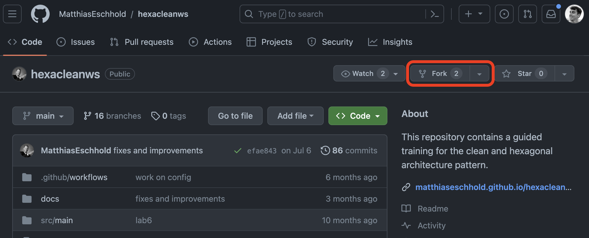
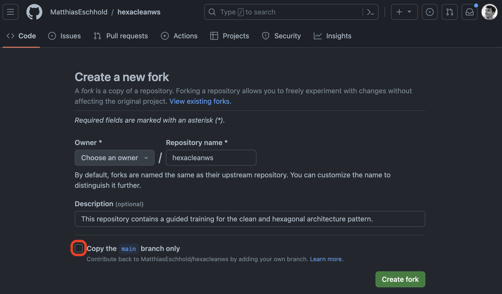

# Git

This section describes some useful git basics how you can "copy" it to your own remote repo.

* [Fork The Repository](#fork-the-repository)
* [Custom Repository](#custom-repository)
    * [Clone](#clone)
    * [Change the Remote](#change-the-remote)

## Fork The Repository

If you want to keep track of the original repository, but add your own branches simply 
[fork](https://docs.github.com/en/get-started/quickstart/fork-a-repo) it.

1. Navigate to the repository: https://github.com/MatthiasEschhold/hexacleanws
2. In the top-right corner of the page, click Fork.
   
3. Do **not** select Copy the DEFAULT branch only.
   
4. Click Create fork. 🎉

## Custom Repository

If forking the repository is not an option, you need to change the remote origin to yours after cloning it:

### Clone

To clone the repository simply run:

```shell
$ git clone https://github.com/MatthiasEschhold/hexacleanws.git
```

### Change the Remote

To change the remote origin to your custom one, rename the old one and set the new one:

```shell
# Rename the current origin
$ git remote rename origin MatthiasEschhold-origin

# Set the new remote origin
$ git remote set-url origin <https://git-repo/new-repository.git>
```
