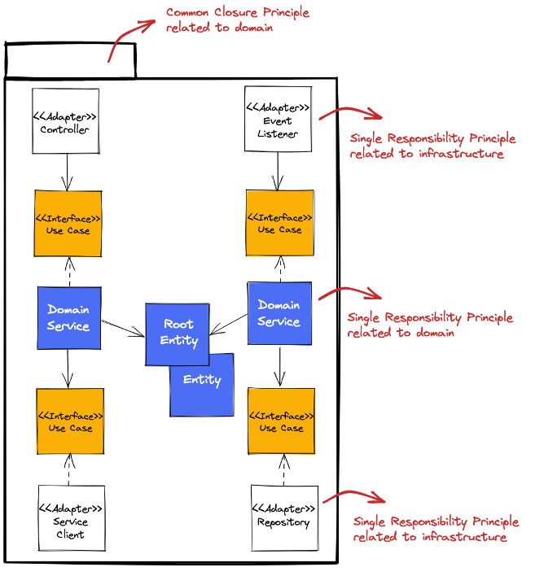
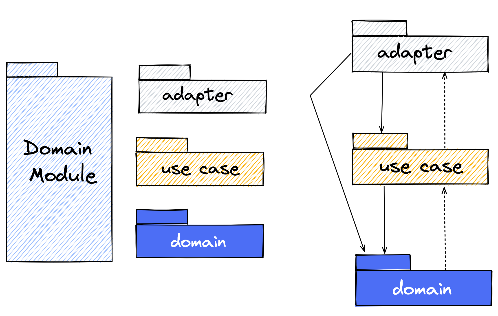
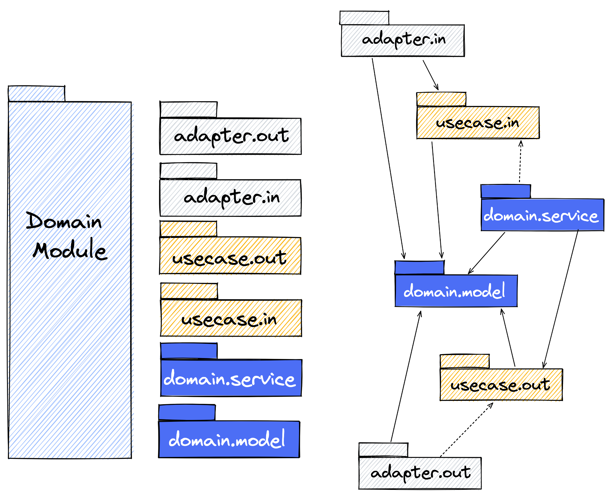

# Clean Architecture Pattern Fundamentals

## Ports & Adapters Pattern

## Clean Architecture Pattern

Look at ring model of the clean architecture pattern. Try to understand the fundamental separation of the domain and the
infrastructure.


**True or False?**

1. The infrastructure provides interfaces which the domain can implement.
2. Adapter implementations (also known as adapters) are located within the infrastructure ring and are responsible to
   integrate and access infrastructure components (e.g. file system, http in- and outbound).
3. The domain only depends on use cases located in the use case ring.
4. The domain provides interfaces which will be implemented by adapters.
5. Use case definitions are driven by adapters.
6. The use case ring connects the infrastructure and the domain.
7. Use case definitions are driven by domain.

<details>
<summary>Solution</summary>
   <table>
      <tr>
         <th>Statement</th>
         <th>True / False</th>
      </tr>
      <tr>
         <td>
            The infrastructure provides interfaces which the domain can implement.
         </td>
         <td>
            False
         </td>
      </tr>
      <tr>
         <td>
            The adapters are located within the infrastructure ring and are responsible to
   integrate and access infrastructure components (e.g. file system, http in- and outbound).
         </td>
         <td>
            True
         </td>
      </tr>
      <tr>
         <td>
             The domain only depends on use cases located in the use case ring.
         </td>
         <td>
            True
         </td>
      </tr>
      <tr>
         <td>
            The domain provides interfaces which will be implemented by adapters.
         </td>
         <td>
            True
         </td>
      </tr>
      <tr>
         <td>
            Use case definitions are driven by adapters.
         </td>
         <td>
            False
         </td>
      </tr>
      <tr>
         <td>
            The use case ring connects the infrastructure and the domain.
         </td>
         <td>
            True
         </td>
      </tr>
      <tr>
         <td>
            Use case definitions are driven by domain.
         </td>
         <td>
            True
         </td>
      </tr> 
   </table>
</details>

## Underlying Design Principles

### Common Closure and Separation of Concerns

The _common closure principles_ says:

---
_The classes of a package should be closed together against the same kind of changes. A change that affects a package
affects all the classes in that package and no other package._

Some people also say that the _common closure principle_ describes the _single responsibility principle_ for packages.
The reason is that the same kind of changes is in most cases related to functional or domain-related requirements.

The conclusion is that the package should be sliced vertically by domain object and functions (e.g. _vehicle_ or
_vehicle data_) and not horizontally by technical characteristics (e.g. _controller_ or _services_). There is
another principle, the so-called
_separation of concerns_, which describes the same idea.

_Separation of concerns_:

---
Separate different aspects of a problem and manage every sub-problem on its own. Based on this create semantical chunks,
so that the complexity of each chunk can be handled easier.


### Single Responsibility and SOLID

The single responsibility principle says:

---
_There should never be more than one reason for a class to change!_

_-Tom DeMarco & Meilir Page-Jones_

In comparison to the _common closure principle_ and _separation of concerns_, which affects the package level, the _single
responsibility principle_ affects the class level.

This is also the case for the other principles of SOLID. SOLID stands for:

* **Single Responsibility Principle**
* Open Closed Principle
* Liskov Substitution Principle
* **Interface Segregation Principle**
* **Dependency Inversion Principle**

During the training, we discuss the principles highlighted in bold.

An associated goal is to **separate technical** and **domain-related aspects** within the **common closure**.
This could be reached by class stereotypes containing a clear task, that this stereotype has to
do. The collection of classes is encapsulated in a common closure.  
This means the application will be modularized around domain-related functionality with so-called _domain modules_.
For the clean architecture pattern, the class stereotypes can look like follows:



## Structuring Domain Modules Within Clean Architecture

At the top architectural level, the application is structured by _domain modules_.

For the internal structure of _domain modules_ following variants are known:

* architectural expressive
* architectural expressive domain
* rings by layers

In this training the variant **architectural expressive** will be used. 

### Rings as Layers

The _domain module_ is structured simple according to the rings of the clean architecture pattern.



### Architectural Expressive Domain

In this variant the _use case ring_ is separated in incoming (_in_) and outgoing (_out_) use cases. Additional, the
_domain ring_ is separared in _service_ and _model_.


### Architectural Expressive

In this package structure variant the adapter ring is also structured according to the semantics of _in_ and _out_.



## Domain Ring

### Domain Model

<details>
  <summary>Coding Task 1.1</summary>

<b>Implement a Self-Validating Domain Model</b>
<br/>
<ol>
   <li>Create the root entity <i>Vehicle</i> and place it in the designated package</li>
   <li>Create the value object <i>Vin</i> and place it in the designated package</li>
   <li>Ensure that the <i>Vehicle</i> can only be created with a valid vehicle identification number (vin)</li>
   <li>Override equals, so that the Vehicle is the same object when the VIN is the same</li>
   <li>A vehicle identification number is valid when the value follows the regex pattern below. Throw an
   exception in case of validation errors.</li>
</ol>

   <details>
     <summary>VIN Regex Pattern for Java / Kotlin</summary>
   
   ```java
   
   // examples
   // WP0ZZZ99ZTS392155
   // WBAOLZ99ZTS349156
   
   "(?=.*\\d|=.*[A-Z])(?=.*[A-Z])[A-Z0-9]{17}"
   
   ```
   </details>

   <details>
     <summary>VIN Regex Pattern for C#</summary>
   
   ```java
   
   // examples
   // WP0ZZZ99ZTS392155
   // WBAOLZ99ZTS349156
   
   "(?=.*\d|=.*[A-Z])(?=.*[A-Z])[A-Z0-9]{17}"
   
   ```
   </details>


</details>

<details>
  <summary>Verify Task 1.1</summary>
   <b>RUN</b> DomainRing_Task_1_1
   <br/>
   <b>RUN</b> ArchitectureTest_Task_1_1
</details>

### Domain Service

<details>
   <summary>Coding Task 1.2</summary>
   <b>Create the (Domain) Service for the Root Entity</b>
   <br/>
   <ol>
      <li>Create the class stereotype (domain) service <i>VehicleService</i> and place it in the designated package</li>
      <li>The <i>VehicleService</i> should provide the method find by vin (see listings for java, kotlin and c#)</li>
      <li>Return a hard-coded instance of the class <i>Vehicle</i> with the vin</li>
   </ol>

```java

WP0ZZZ99ZTS392155

```
   
   <details>
      <summary>Java</summary>

```java
public Vehicle findByVin(Vin vin){...}
```

   </details>

   <details>
      <summary>Kotlin</summary>

```kotlin

fun findByVin(vin: Vin): Vehicle {
    ...
}

```

   </details>
   <details>
      <summary>C#</summary>

```java

public VehicleRootEntity FindByVin(Vin vin){...}

```

   </details>
   
</details>

<details>
  <summary>Verify Task 1.2</summary>
   <b>RUN</b> DomainRing_Task_1_2
   <br/>
   <b>RUN</b> ArchitectureTest_Task_1_2
</details>

[//]: # ()
[//]: # (### Task 1.3 [Optional]: Meet domainprimitives-java)

[//]: # ()
[//]: # (Have a look at [domainprimitives-java]&#40;https://github.com/domain-primitives/domain-primitives-java&#41; and compare it to)

[//]: # (the native validation approach you implemented.)

[//]: # ()
[//]: # (If you want, adapt your implementation. There are all dependencies you need already configured in the pom.xml. Or use)

[//]: # (the following declaration:)

[//]: # ()
[//]: # (```xml)

[//]: # ()
[//]: # (<dependency>)

[//]: # (    <groupId>io.github.domain-primitives</groupId>)

[//]: # (    <artifactId>domainprimitives-java</artifactId>)

[//]: # (    <version>0.1.0</version>)

[//]: # (</dependency>)

[//]: # (```)

[//]: # ()
[//]: # (The idea is not unqiue. There are several similiar libraries, like)

[//]: # ()
[//]: # (* https://github.com/albertattard/domain-primitives-api or)

[//]: # (* https://github.com/prashantbasawa/simple-validation-framework)

[//]: # (* and others)

[//]: # ()
[//]: # (Please notice: There are not evaluated from my side.)

[//]: # ()
[//]: # (It exist also concepts in the [java and spring ecosystem]&#40;https://reflectoring.io/bean-validation-with-spring-boot/&#41;)

[//]: # (for implementing self-validating domain objects called _bean validation_.)

[//]: # ()
[//]: # (#### For Kotlin Coders)

[//]: # ()
[//]: # (There origin idea of [domainprimitives-java]&#40;https://github.com/domain-primitives/domain-primitives-java&#41; is based on)

[//]: # (Stefan)

[//]: # (Ludwig's [comparison of strongly typed validation and javax validation]&#40;https://github.com/slu-it/technology-examples/tree/master/strongly-typed-vs-javax-validation&#41;)

[//]: # (written in kotlin.)

[//]: # ()
[//]: # (For more details have a look)

[//]: # (into [the domain object Age with native self-validation]&#40;https://github.com/slu-it/technology-examples/blob/master/strongly-typed-vs-javax-validation/src/main/kotlin/example/stronglytyped/model/Age.kt&#41;)

[//]: # (as well as)

[//]: # (into [the domain object Age with self-validation based on a DSL]&#40;https://github.com/slu-it/technology-examples/blob/master/strongly-typed-vs-javax-validation/src/main/kotlin/example/stronglytypedwithdsl/model/Age.kt&#41;)

[//]: # (.)

[//]: # ()
[//]: # (Look at)

[//]: # (the [validation DSL]&#40;https://github.com/slu-it/technology-examples/blob/master/strongly-typed-vs-javax-validation/src/main/kotlin/example/stronglytypedwithdsl/validation/dsl.kt&#41;)

[//]: # ()
[//]: # (Seems this for you a good alternative approach to your native validation? If you like, adapt your implementation, but)

[//]: # (consider the time.)

[//]: # ()
[//]: # (#### For C# Coders)

[//]: # ()
[//]: # (Do you know similiar approaches like _domainprimitives-java_? Discuss this in a _Breakout Room_ and apply it in your implementation.)
