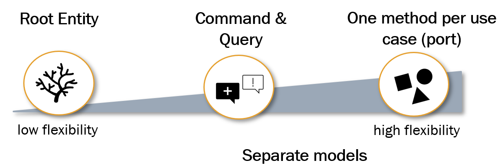

# The Domain Grows Part II

## Slicing Use Cases with the Interface Segregation Principle

_Robert C. Martin_ points out in his book _Clean Architecture_ that

<blockquote cite="https://example.com/optional-reference">
depending on something that carries baggage that
you don't need can cause you trouble that you didn't expect!
</blockquote> 

The _Interface Segregation Principle_ provides an answer to this problem. It states that broad 
interfaces should be split into specific ones so that clients only know the methods they need.

Applying the _Interface Segregation Principle_

* **removes unnecessary dependencies** to methods the consumer doesn't need,
* makes the existing **dependencies more visible**,
* **prevents** potential trouble based on **side effects** and,
* enables **extendibility** and **flexibility** 

In origin sense the _Interface Segregation Principle_ says:

---
Many client-specific interfaces increase readability and understandability compared to one general-purpose interface. 
No clients should be forced to depend on methods it does not use. In conclusion, interfaces should be separated into small 
responsibilities as minimalistic as possible.



Personally I do not use the option _Root Entity_. As a default I use the option _Command & Query_. When different
consumer exists and there are difference between their needs, then I recommend using the option _One Method Per
Use Case (Port)_. Also referring to the package structure variants, there is a _separation of incoming and outgoing use
cases_, which is recommended to _apply_ as _standard design principle_.

Following code examples shows different variants of slicing use cases.

**Use Cases by Root Entity**

```java

public interface VehicleUseCase {

    Vehicle readByVin(Vin vin);

    Vehicle readByLicensePlate(LicensePlate licensePlate);

    Vehicle update(Vin vin, VehicleMotionData vehicleMotionData);

    Vehicle create(Vehicle vehicle);

    void delete(Vin vin);
}
```

**Use Case by Separating Command and Query**

```java

public interface VehicleQuery {

    Vehicle readByVin(Vin vin);

    Vehicle readByLicensePlate(LicensePlate licensePlate);
}
```

```java

public interface VehicleCommand {

    Vehicle update(Vin vin, VehicleMotionData vehicleMotionData);

    Vehicle create(Vehicle vehicle);

    void delete(Vin vin);
}
```

A separation in _Command and Query_ helps to prevent, that classes grow into complex and big units of code that are
hard to understand. A good orientation for modularisation inside a _domain module_ can be found in _Command and Query_, even
when you do not plan to apply the [Command Query Segregation Principle](https://martinfowler.com/bliki/CQRS.html). 
But we can create a good foundation for such an evolution.

**One Method per Use Case (Port)**

```java
public interface ReadVehicleByVin {

    Vehicle read(Vin vin);
}
```

```java
public interface ReadVehicleByLicensePlate {

    Vehicle read(LicensePlate licensePlate);
}
```

```java
public interface CreateVehicle {

    Vehicle readByVin(Vin vin);

    Vehicle readByLicensePlate(LicensePlate licensePlate);
}
```

```java
public interface UpdateVehicle {

    Vehicle update(Vin vin, VehicleMotionData vehicleMotionData);
}
```

```java
public interface DeleteVehicle {

    void delete(Vin vib);
}
```

Even when the variant _One Method per Use Case_ is not typical Java, slicing use cases this way reduces coupling
between clients. In conclusion, the overall coupling between components of the software system will be kept low.
Coupling rises quickly and unavoidable. Due to this, we should avoid it every time when possible, especially in
fast-growing software systems for complex business domains.

Small sliced use cases allow assembling these use cases to a higher composition of functionality. Based on this,
functionality can be extended fast for new or changing business processes or user group specific requirements.

### Slicing Use Cases in Practice

There is no right way by default. It depends on complexity and specific requirements of the project. 
In practice a reasonable combination of these variants is may the best way to find a good balance between flexibility and 
simplicity in the architecture in the long term.

Let's have a look on following functional requirements. As we already know, we have the mission to build a great garage
management that is maintainable, extendable and flexible. We want to modernize existing business processes and establish
new business models. And the system now starts to live, and we can expect an evolution over the years because the
business model change over time due to changing requirements of the stakeholder as well as technical evolution, which
creates the need of modernization.

## Refactor VehicleService and VehicleRepository

<details>
<summary>Coding Task 5.1</summary>
Now it will be clear, why we named the already implemented use cases the way we did. The next step is to make the
separation more clear in our current implementation.

Rename the
<ul>
   <li> 
      <i>VehicleService</i> to <i>VehicleQueryService</i>
   </li>
   <li>
      <i>VehicleRepository</i> to <i>VehicleQueryRepository</i> 
   </li>
</ul>

</details>

<details>
   <summary>Verify 5.1</summary>
   <b>RUN</b> OutputAdapter_Task_5_1
   <br/>
   <b>RUN</b> DomainRing_Task_5_1
   
   <details>
      <summary>Java & Kotlin</summary>
      The <i>CleanArchitectureTest</i> located in <i>src/test/java/de/arkem/hexaclean/arc/demo/lab/test</i> is a generic test for checking
      the architecture rules of the clean architecture pattern based on [ArchUnit](https://www.archunit.org/).
      <br/>
      <b>RUN</b> CleanArchitectureTest
      <br/>
      <b>RUN</b> all (other) architecture tests
   </details>
   
   <details>
      <summary>C#</summary>
      <b>RUN</b> all architecture tests
   </details>
</details>

## Introduce VehicleCommand and VehicleDbCommand

<details>
   <summary>Coding Task 5.2</summary>
   In the next step, we want to introduce functionality to create a vehicle and update the vehicle motion data.
   <ol>
      <li>
         Introduce the incoming use case <i>VehicleCommand</i> that provides the methods <i>create</i> and <i>update</i>
      </li>
      <li>
         Introduce the <i>VehicleCommandService</i> and implement <i>VehicleCommand</i>
      </li>
      <li>
         Introduce the outgoing use case <i>VehicleDbCommand</i> that provides the method <i>save</i>
      </li>
         Introduce the <i>VehicleCommandRepository</i> and implement the <i>VehicleDbCommand</i> 
      <li>
         Extend the <i>VehicleToVehicleDbEntityMapper</i>  with the necessary mappings
      </li>
      <li>
         Extend the <i>VehicleController</i> with REST interface for <i>create</i> and <i>update</i>. 
         Use the <i>VehicleCommand</i> to connect to the domain.
      </li>
      <li>
         Extend the <i>VehicleToVehicleResourceMapper</i> with the necessary mappings
      </li>
      <li>
         Consider always placing all classes it in the designated packages.
      </li>
   </ol>
   
   <b>VehicleCommand</b>

   <details>
      <summary>Java</summary>
   
```java
Vehicle create(Vehicle vehicle);
Vehicle update(Vin vin,VehicleMotionData vehicleMotionData);
```
   
   </details>
   
   <details>
      <summary>Kotlin</summary>
   
```kotlin
fun create(vehicle: Vehicle): Vehicle
fun update(vin: Vin, vehicleMotionData: VehicleMotionData): Vehicle
```
   
   </details>
   
   <details>
      <summary>C#</summary>
   
```java
Vehicle Create(Vehicle vehicle);
Vehicle Update(Vin vin, VehicleMotionData vehicleMotionData);
```
   
   </details>

   <b>VehicleDbCommand</b>
   
   <details>
      <summary>Java</summary>
   
```java
Vehicle save(Vehicle vehicle);
```
   
   </details>
   
   <details>
      <summary>Kotlin</summary>
   
```kotlin
fun save(vehicle: Vehicle): Vehicle
```
   
   </details>
   
   <details>
      <summary>C#</summary>
   
```java
Vehicle Save(Vehicle vehicle);
Vehicle Update(Vin vin, VehicleMotionData vehicleMotionData);
```
   
   </details>

   <b>VehicleController</b>

   <details>
      <summary>Java</summary>
   
```java
VehicleResource create(VehicleResource vehicle);
VehicleResource update(String vin,VehicleMotionDataResource vehicleMotionData);
```
   
   </details>

   <details>
      <summary>Kotlin</summary>
   
```kotlin
fun save(vehicle: Vehicle): Vehicle
```
   
   </details>

   <details>
      <summary>C#</summary>
   
```java
Vehicle Save(Vehicle vehicle);
```
   
   </details>

</details>

<details>
   <summary>Verify 5.2</summary>
   <b>RUN</b> CleanArchitectureTest (Java & Kotlin)
   <br/>
   <b>RUN</b> all architecture tests
</details>

## Rich vs. Anemic Domain Model

Based on the functionality if a vehicle supports a 5G connection, a comparison between a rich or anemic domain model
will be discussed. Let's imaging the fact if a vehicle supports 5G or not can be derived from the equipment list. If
there is a 5G modul built-in, then the vehicle supports 5G.

This simplified code snippet should make the scenario more clear:

```java
boolean determine5GSupport(List<Equipment> equipmentList){
     for(Equipment equipment:equipmentList){
         if(equipment.getCode().equals("GS500")){
             return true;
         }
     }
     return false;
}
```

## Rich Domain Model - Data, Validation and Behaviour

<details>
   <summary>Coding Task 5.3</summary>
Currently, our domain model contains data and validation. Now the functionality to determine 5G support will be added as
additional behaviour. The determination can be done without any additional dependencies. So it is possible to integrate
the behaviour within the domain model.
   <ol>
      <li>Add the boolean property _has5GSupport_ to the _Vehicle_ and _VehicleResource_ class</li>
      <li>Extend the <i>VehicleToVehicleResourceMapper</i></li>
      <li>Implement the behaviour for <i>has5GSupport</i></li>
      <li>Trigger the behaviour during object creation or as soon as the equipment list will changed</li>
   </ol>
</details>

<details>
   <summary>Verify 5.3</summary>
   <b>RUN</b> DomainRing_Task_5_3 
   <br/>
   <b>RUN</b> DomainRing_Task_4_5
   <br/>
   <b>RUN</b> CleanArchitectureTest (Java & Kotlin)
   <br/>
   <b>RUN</b> all architecture tests
</details>

## Optional: Clean Domain Model with Full Mapping Strategy

Use the branch <i>lab/{versionnumber}/lab5-full-mapping</i>.

<details>
<summary>Optional Coding Task 5.5</summary>
Let's change the scenario a little. For our domain the equipment list is not relevant. We need this only to
determine the enriched domain value <i>has5GSupport</i>.
<br/>
<br/>
We are very accurate and want to create an absolutely clean domain model. 
When our domain does not have to know a equipment list,
then the <i>Vehicle</i> should not contain it.
<br/>
<br/>
Implement this simplified scenario to get a feeling about decoupling domain logic from infrastructure 
in more complex scenarios by using the <i>Full Mapping Strategy</i>.
<br/>
<br/>
Look in the package <i>vehicle/domain/dto</i>. The so-called <i>DomainDTO</i> differs from the <i>DTO</i> 
of an infrastructure component like a <i>DbEntity</i> or <i>Resource</i>. The <i>DomainDTO</i> is used to decouple 
a external <i>DTO</i> from the domain model, when this is only possible with an additional ring and mapping between 
all these rings.

<ol>
   <li>
      Remove the property <i>equipmentList</i> of <i>Vehicle</i> class
   </li>
   <li>
      Remove the domain objects <i>Equipment</i> and <i>EquipmentCode</i>
   </li>
   <li>
      Remove the property <i>equipmentList</i> in <i>VehicleResource</i>
   </li>
   <li>
      Move the method <i>determine5GSupport</i> to <i>VehicleQueryService</i> (or to a dedicated domain service)
   </li>
   <li>
      Adapt the constructor of <i>Vehicle</i>, so that the property <i>has5GSupport</i> is part of it.
   </li>
   <li>
      Change the return value of the use case <i>FetchVehicleMasterData</i> to <i>VehicleMasterDataDomainDTO</i> 
   </li>
   <li>
      Adapt the mapper <i>VehicleToVehicleDataDtoMapper</i>
   </li>
   <li>
      Adapt the orchestration within the method <i>findByVin</i> of <i>VehicleQueryService</i> 
   </li>
   <li>
      Fix the compilation errors in existing unit tests 
   </li>
</ol>

</details>

<details>
   <summary>Verify 5.5</summary>
   <b>RUN</b> all unit tests
   <br/>
   <b>RUN</b> CleanArchitectureTest (Java & Kotlin)
   <br/>
   <b>RUN</b> all architecture tests
</details>

