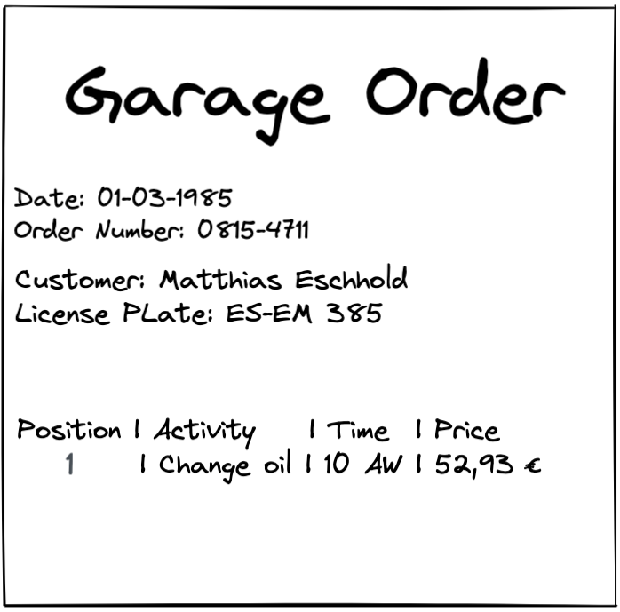
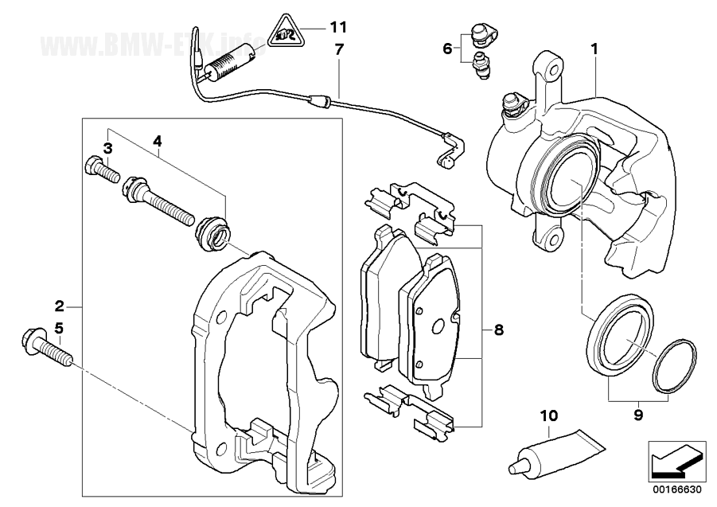
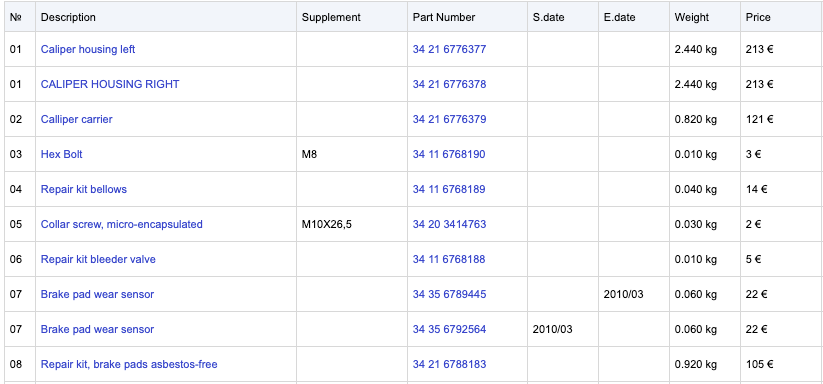

# The Domain Grows Part III

## New Domain Modules

Investigate the introduced domain modules _GarageOrder_ and _PartsCatalogue_. Both domain modules 
depends on the _Vehicle_ domain module.

In context of the garage order only the _license plate_ and, the _mileage_ of a vehicle are relevant. 
 
For the parts catalogue only the _vin_, the _vehicle model_ and, the domain value _has5GSupport_ 
are from importance.

See the garage order form for more details:



See also the explosion chart of the front brake, as a example for the graphical visualization of a spare part in the parts catalogue:



Additional information are described in the corresponding spare parts table.



## Design Dependencies Between Domain Modules

In a traditional data-centric and layered architecture, it is common to design the application around a centric data model. 
But this leads to high coupling in the long term (see section "Problems of Layered Architecture" in the trainings slides). 
In this lab the <i>Adapter.Out - UseCase.In Pattern</i> and the <i>Application Service Pattern</i> are described. Additional approaches
are shown in the training slides.

## The Adapter.Out - UseCase.In Pattern

Implement the <i>Adapter.Out - UseCase.In Pattern</i> between the domain modules <i>Garage order</i> and <i>Vehicle</i>.

### Introduce the Use Case FetchVehicleByLicensePlate (Vehicle Module)

<details>
   <summary>Coding Task 6.1</summary>
   <ol>
      <li>
         Introduce an additional incoming use case in the domain module <i>Vehicle</i> with the name 
         <i>FetchVehicleByLicensePlate</i>. The use case should contain the method <i>fetchByLicensePlate</i>
      </li>
      <li>
         Implement the use case by extending the <i>VehicleQueryService</i>.
      </li>
   </ol>
   
   <details>
      <summary>Java</summary>

```java
Vehicle fetchByLicensePlate(LicensePlate licensePlate);
```

</details>

<details>
      <summary>Kotlin</summary>

```kotlin
fun fetchByLicensePlate(licensePlate: LicensePlate): Vehicle;
```

   </details>

   <details>
      <summary>C#</summary>

```java
Vehicle FetchByLicensePlate(LicensePlate licensePlate);
```

   </details>

</details>

<details>
   <summary>Verify 6.1</summary>
   <b>RUN</b> DomainRing_Task_6_1
   <br/>
   <b>RUN</b> ArchitectureTest_Task_6_1 (Java & Kotlin)
   <br/>
   <b>RUN</b> all architecture tests (C#)
</details>

### Implement the Use Case FetchVehicle (Garage Order Module)

<details>
<summary>Coding Task 6.2</summary>
   <ol>
      <li>
         Have a look at the outgoing use case <i>FetchVehicle</i> in <i>garage/order/usecase/out</i>
      </li>
      <li>
         Implement the output adapter with the name <i>VehicleModuleClient</i> and a mapper with the name 
         <i>VehicleToOriginVehicleMapper</i>.
      </li>
   </ol>
</details>

<details>
   <summary>Verify 6.2</summary>
   <b>RUN</b> OutputAdapter_Task_6_2
   <br/>
   <b>RUN</b> ArchitectureTest_Task_6_2 (Java & Kotlin)
   <br/>
   <b>RUN</b> all architecture tests (C#)
</details>

## The Application Service Pattern

<details>
   <summary>Coding Task 6.3</summary>
Implement the <i>Application Service Pattern</i> between the domain modules <i>Parts Catalogue</i> and <i>Vehicle</i>.
<ol>
   <li>
      Have a look at the <i>ExplosionChartApplicationService</i> in <i>parts/catalogue/appservice</i> and notice the dependency to
      <i>VehicleQuery</i> of the domain module vehicle.
   </li>
   <li>
        Complete the implementation of the use case <i>ExplosionChartQuery</i> in <i>ExplosionChartQueryService</i>
   </li>
   <li>
        Use <i>VehicleQuery</i> from the vehicle module to fetch necessary vehicle data
   </li>
    <li>
        Implement and use the mapper <i>VehicleToOriginVehicleMapper</i>
   </li>
</ol>

</details>

<details>
   <summary>Verify 6.3</summary>
   <b>RUN</b> ApplicationService_Task_6_3
   <br/>
   <b>RUN</b> ArchitectureTest_Task_6_3 (Java & Kotlin)
   <br/>
   <b>RUN</b> all architecture tests (C#)
</details>

##  Clean Architecture Fitness Functions - Currently Not Working

<details>
   <summary>Optional Coding Task 6.4</summary>

<ol>
   <li>
      <b>RUN</b> CleanArchitectureTest
   </li>
   <li>
      Fix the test by extending the test <i>should_check_clean_architecture_all_rings_architectural_expressive</i> 
   </li>
   <li>
      <b>RUN</b> CleanArchitectureTest again. Why did the test pass now?
   </li>
</ol>
</details>

<details>
   <summary>Java & Kotlin</summary>

```java
.adapterOutOfAdapterOutUseCaseInPattern("..garage.order.adapter.out..")
.applicationService("..parts.catalogue.appservice..")
```

</details>
