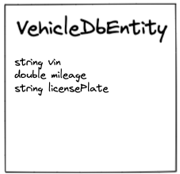

# The Domain Grows Part I

## Implement the Domain Model

Coding Task 4.1

Understand the root entity <i>Vehicle</i> and implement the missing value object according to the UML
class diagram and the validation rules described in the table below.

Value Object Validation Rules

<table>
    <tr>
        <th>Domain Object</th>
        <th>Validation Rule</th>
    </tr>
    <tr>
        <td>LicensePlate</td>
        <td><i>A-ZÖÜÄ]{1,3}-[A-ZÖÜÄ]{1,2} [1-9]{1}[0-9]{1,3}</i></td>
    </tr>
    <tr>
        <td>EquipmentCode</td>
        <td><i>[A-Z]{2}[0-9]{3}</i></td>
    </tr>
    <tr>
        <td>Mileage</td>
        <td>no negative value (mileage >= 0)</td>
    </tr>
</table>

Root Entity Validation Rules

<table>
    <tr>
        <th>Domain Object</th>
        <th>Validation Rule</th>
    </tr>
    <tr>
        <td>VehicleMotionData</td>
        <td>All fields are mandatory, all values must fulfil the validation rules</td>
    </tr>
    <tr>
        <td>Vehicle</td>
        <td>Vin, Vehicle Masterdata are mandatory</td>
    </tr>
</table>

Verify 4.1

<b>RUN</b> DomainRing_Task_4_1
 
<b>RUN</b> ArchitectureTest_Task_4_1

## Extend the Input Adapter

Coding Task 4.2

Extend the <i>VehicleResource</i> like described as follows and adapt the <i>VehicleController</i> as well as 
the <i>VehicleToVehicleResourceMapper</i>.

Verify 4.2

<b>RUN</b> InputAdapter_Task_4_2
 
<b>RUN</b> all architecture tests

## Introduce the VehicleMasterDataServiceClient

Coding Task 4.3

There are some constraints given by the company context. There is one central system for 
vehicle master data. This system provides the necessary master data.
 
 
Due to this you have to introduce the <i>VehicleMasterDataServiceClient</i> and create the adapter 
implementation with the name <i>VehicleMasterDataToVehiceDtoMapper</i>. 
The external data object <i>VehicleDataDto</i> (package <i>vehicle/adapter/out/dto</i>) and the 
outgoing use case FetchVehicleMasterData (package <i>vehicle/usecase/out</i>) are already prepared for this task.
 
 
The external API returns a lot of information we do not need in our domain. This is visible in the
<i>VehicleDataDto</i> class. For example the property <i>salesRelatedInformation</i> is not needed in our domain.
Due to this we only extract the properties we defined in the
<i>VehicleMasterData</i> domain object. 
 
 
Have a look at the <i>VehicleDataDto</i> and implement the service client and mapper.

Verify 4.3

<b>RUN</b> OutputAdapter_Task_4_3
 
<b>RUN</b> all architecture tests

## Extend the Output Adapter

Coding Task 4.4

The vehicle motion data and other informations that not belongs to vehicle master data will be store in the database
of our application. This means we are owner of data and state for vehicle motion data.

Extend the <i>VehicleDbEntity</i> and the <i>VehicleToVehicleDbEntityMapper</i> as described in the diagram.

Verify 4.4

<b>RUN</b> OutputAdapter_Task_4_4
 
<b>RUN</b> all architecture tests

## Extend the VehicleService

Coding Task 4.5

Extend the <i>VehicleService</i>, so that vehicle motion data will be queried from database, and 
vehicle master data will be queried from a external API.

Verify 4.5

<b>RUN</b> OutputAdapter_Task_4_5
 
<b>RUN</b> all architecture tests

