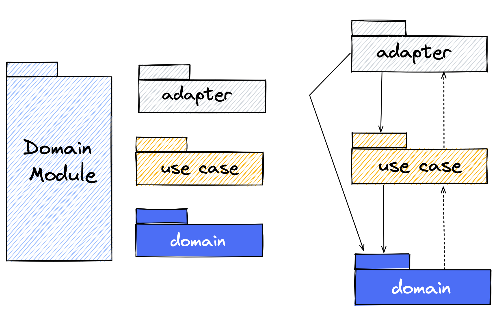
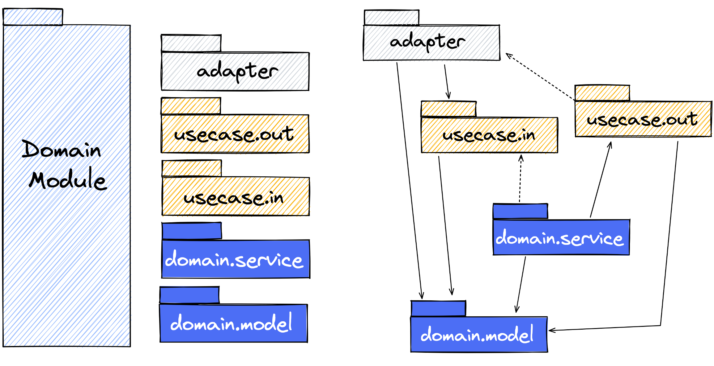
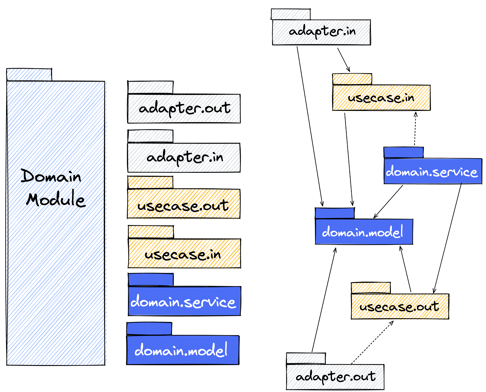

# Lab 1 Clean Architecture Pattern, Modularization, SOLID and Domain Modules

## General Information

Please follow the package, class, and method names as described in the exercises.

## Clean Architecture Pattern and Underlying Design Principles

### Clean Architecture Pattern

Look at ring model of the clean architecture pattern. Try to understand the fundamental separation of the domain and the
infrastructure.


**True or false?**

1. The infrastructure provides interfaces which the domain can implement.
2. Adapter implementations (also known as adapters) are located within the infrastructure ring and are responsible to
   integrate and access infrastructure components (e.g. file system, http in- and outbound).
3. The domain only depends on use cases located in the use case ring.
4. The domain provides interfaces which will be implemented by adapters.
5. Use case definitions are driven by adapters.
6. The use case ring connects the infrastructure and the domain.
7. Use case definitions are driven by domain.

[Solution](Lab1-true-false-solution.md)

### Common Closure and Separation of Concerns

The _common closure principles_ says:

---
_The classes of a package should be closed together against the same kind of changes. A change that affects a package
affects all the classes in that package and no other package._

Some people also say that the _common closure principle_ describes the _single responsibility principle_ for packages.
The reason is that the same kind of changes is in most cases related to functional or domain-related requirements.

The conclusion is that the package should be sliced vertically by domain object and functions (e.g. _vehicle_ or
_vehicle data_) and not horizontally by technical characteristics (e.g. _controller_ or _services_). There is
another principle, the so-called
_separation of concerns_, which describes the same idea.

_Separation of concerns_:

---
Separate different aspects of a problem and manage every sub-problem on its own. Based on this create semantical chunks,
so that the complexity of each chunk can be handled easier.


### Single Responsibility and SOLID

The single responsibility principle says:

---
_There should never be more than one reason for a class to change!_

_-Tom DeMarco & Meilir Page-Jones_

In comparison to the common closure principle and separation of concerns, which affects the package level, the single
responsibility principle affects the class level.

This is also the case for the other principles of SOLID. SOLID stands for

* **Single Responsibility Principle**
* Open Closed Principle
* Liskov Substitution Principle
* **Interface Segregation Principle**
* **Dependency Inversion Principle**

During the training, we discuss the principles highlighted in bold.

An associated goal is to separate technical and domain-related aspects within the common closure.
This could be reached by class stereotypes containing a clear task, that this stereotype has to
do. The collection of classes is encapsulated in a common closure.  In other words,
the application will be modularized around domain-related functionality based on _domain modules_.
For the clean architecture pattern class stereotypes can look like follows:


In this training we will meet all class stereotypes step by step.

## Structuring Domain Modules Within Clean Architecture Pattern

At the top architectural level, the application is structured by _domain modules_.

For _domain modules_ there exists several variants to structure internally according to
the principles of the clean architecture pattern. The variants are:

* architectural expressive
* architectural expressive domain
* rings by layers

The recommendation is to use **architectural expressive**. Because layers are something you are more familiar with and
in this variant the concepts of clean architecture pattern will become more visible.

### Rings as Layers

The _domain module_ is structured simple according to the rings of the clean architecture pattern.



### Architectural Expressive Domain

In this variant the _use case ring_ is separated in incoming (_in_) and outgoing (_out_) use cases. Addtionalliy, the
_domain ring_ is separared in _service_ and _model_.



### Architectural Expressive

In this package structure variant the adapter ring is also structured according to the semantics of _in_ and _out_.



## The Domain Ring

### Task 1.1: Implement a Self-Validating Domain Model

1. Create the root entity <i>Vehicle</i> and place it in the designated package
2. Create the value object <i>Vin</i> and place it in the designated package
3. Ensure that the <i>Vehicle</i> can only be created with a valid vehicle identification number (vin)
4. Override equals, so that the Vehicle is the same object when the VIN is the same
5. A vehicle identification number is valid when the value follows the regex pattern below. Throw an
   _Exception_ in case of a validations error.

**Java & Kotlin**

```java

// examples
// WP0ZZZ99ZTS392155
// WBAOLZ99ZTS349156

"(?=.*\\d|=.*[A-Z])(?=.*[A-Z])[A-Z0-9]{17}"

```

**C#**

```java

// examples
// WP0ZZZ99ZTS392155
// WBAOLZ99ZTS349156

"(?=.*\d|=.*[A-Z])(?=.*[A-Z])[A-Z0-9]{17}"

```

#### Verify your Implementation

The demo projects contains architecture tests and unit tests to verify your implementation.
In the most cases it is neccessary to uncomment in the unit tests, after implementing the task. It is
possible that you have to fix the import statements in the unit tests.

**RUN** _DomainRing_Task_1_1_

#### Verify your Architecture

**RUN** _ArchitectureTest_Task_1_1_

### Task 1.2: Create the (Domain) Service for the Root Entity

1. Create the class stereotype (domain) service <i>VehicleService</i> and place it in the designated package
2. The <i>VehicleService</i> should offer following method

**Java**

```java

public Vehicle findByVin(Vin vin){...}

```

**Kotlin**

```kotlin

fun findByVin(vin: Vin): Vehicle {
    ...
}

```

**C#**

```java

public VehicleRootEntity FindByVin(Vin vin){...}

```

Currently, it is enough to return a hard-coded instance of the class <i>Vehicle</i>.
```java

WP0ZZZ99ZTS392155

```
#### Verify your Implementation

**RUN** _DomainRing_Task_1_2_

#### Verify your Architecture

**RUN** _ArchitectureTest_Task_1_2_

### Task 1.3 [Optional]: Meet domainprimitives-java

Have a look at [domainprimitives-java](https://github.com/domain-primitives/domain-primitives-java) and compare it to
the native validation approach you implemented.

If you want, adapt your implementation. There are all dependencies you need already configured in the pom.xml. Or use
the following declaration:

```xml

<dependency>
    <groupId>io.github.domain-primitives</groupId>
    <artifactId>domainprimitives-java</artifactId>
    <version>0.1.0</version>
</dependency>
```

The idea is not unqiue. There are several similiar libraries, like

* https://github.com/albertattard/domain-primitives-api or
* https://github.com/prashantbasawa/simple-validation-framework
* and others

Please notice: There are not evaluated from my side.

It exist also concepts in the [java and spring ecosystem](https://reflectoring.io/bean-validation-with-spring-boot/)
for implementing self-validating domain objects called _bean validation_.

#### For Kotlin Coders

There origin idea of [domainprimitives-java](https://github.com/domain-primitives/domain-primitives-java) is based on
Stefan
Ludwig's [comparison of strongly typed validation and javax validation](https://github.com/slu-it/technology-examples/tree/master/strongly-typed-vs-javax-validation)
written in kotlin.

For more details have a look
into [the domain object Age with native self-validation](https://github.com/slu-it/technology-examples/blob/master/strongly-typed-vs-javax-validation/src/main/kotlin/example/stronglytyped/model/Age.kt)
as well as
into [the domain object Age with self-validation based on a DSL](https://github.com/slu-it/technology-examples/blob/master/strongly-typed-vs-javax-validation/src/main/kotlin/example/stronglytypedwithdsl/model/Age.kt)
.

Look at
the [validation DSL](https://github.com/slu-it/technology-examples/blob/master/strongly-typed-vs-javax-validation/src/main/kotlin/example/stronglytypedwithdsl/validation/dsl.kt)

Seems this for you a good alternative approach to your native validation? If you like, adapt your implementation, but
consider the time.

#### For C# Coders

Do you know similiar approaches like _domainprimitives-java_? Discuss this in a _Breakout Room_ and apply it in your implementation.
